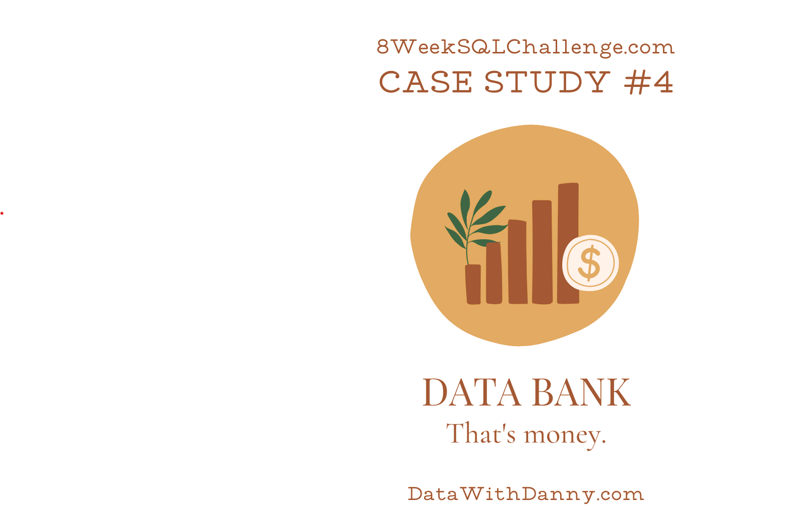

# 8 Week SQL Challenge - Case Study #4: Data Bank

This repository contains my solutions to Case Study #4: Data Bank from the [8 Week SQL Challenge](https://8weeksqlchallenge.com/), created by Danny Ma. I undertook this challenge to enhance my SQL skills and apply them to analyze banking data scenarios.

## Files

- `ddl.sql` – Contains the Data Definition Language (DDL) queries to create the necessary tables and schema.
- `dql.sql` – Contains the Data Query Language (DQL) queries that answer all business analytical questions presented in the case study.

## Purpose

The goal of this challenge is to analyze a digital bank's customer data, focusing on:

- Customer node allocations and reallocations across regions.
- Transaction behaviors, including deposits, withdrawals, and purchases.
- Calculating metrics such as the median, 80th, and 95th percentiles for customer reallocation days per region.
- Analyzing transaction types and customer activities on a monthly basis.

## Tools Used

- PostgreSQL
- DBeaver

## Credits

Challenge created by [Danny Ma](https://www.youtube.com/channel/UCQ6XkhOeO4HiwYok5iZSIAg)
Challenge link: https://8weeksqlchallenge.com/case-study-4/
